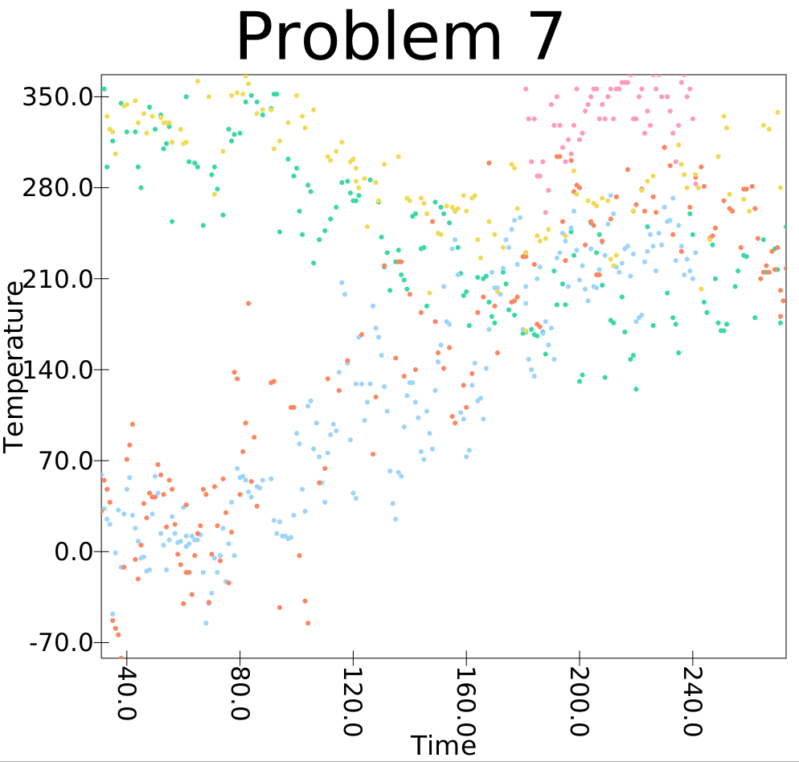

Group Problems:

  1. 4541
  2. 2302
  3. 64.9C,2017/05/22,PEDERSON LAGOON ALASKA
  4. 66141
Individial Problems:

  1. 635mm, 2017/08/27, DAYTON 
  2. 436.1mm, 2017/03/09, BHUBANESWAR 
  3. 38
  4. 14
  5. 34.8C
  6. -0.027054099777969617
  7. Green: Buenos Aires, Blue: Oslo, Orange: Toronto: Pink: Orlando, Yellow: A city in Brazil LAGOA DA CARNAUBA
  